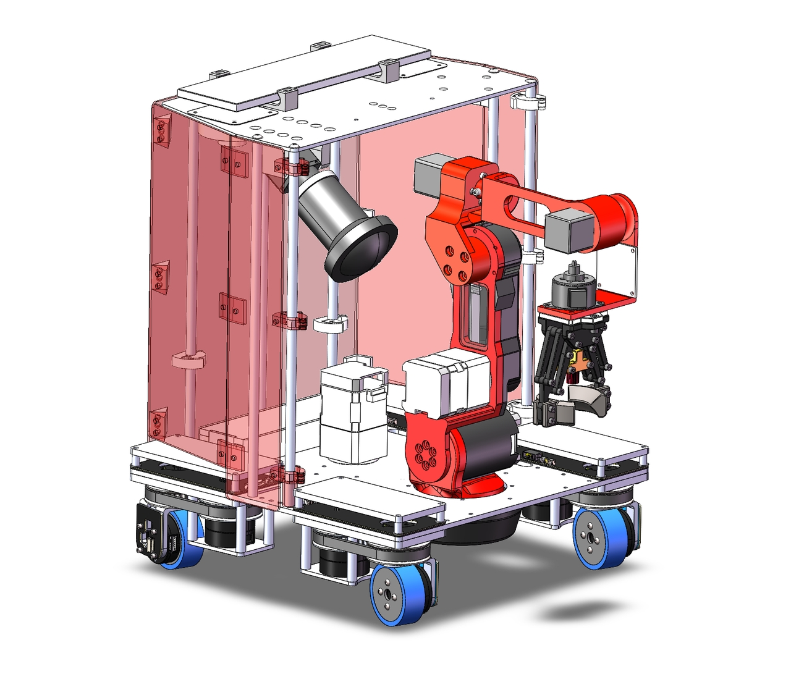
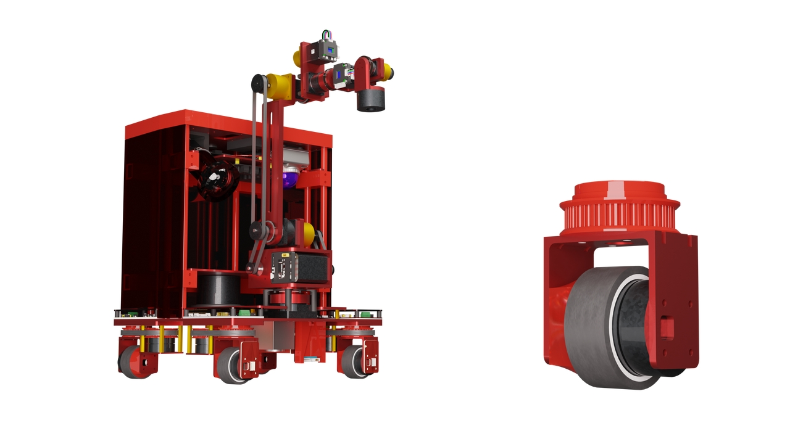
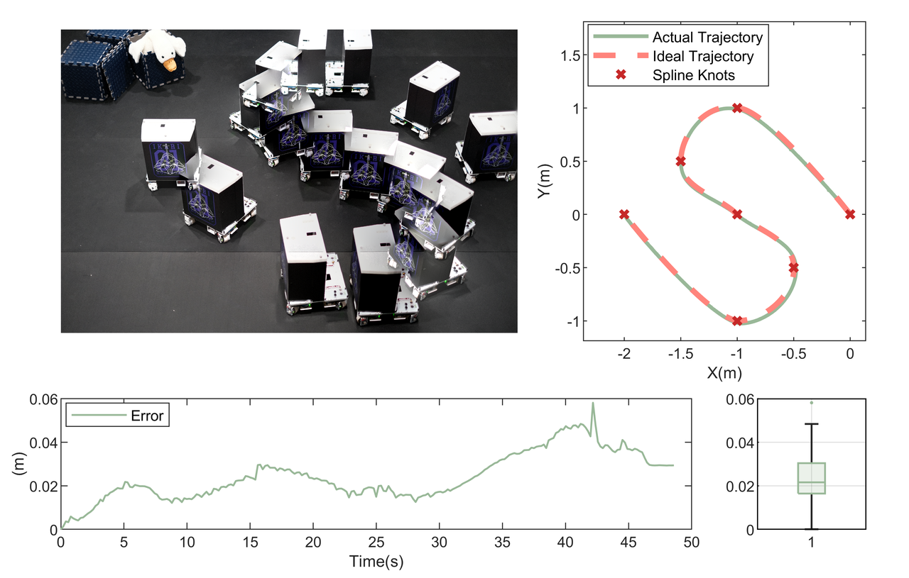
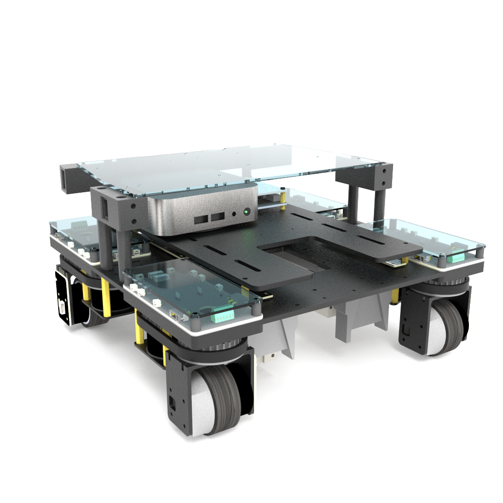
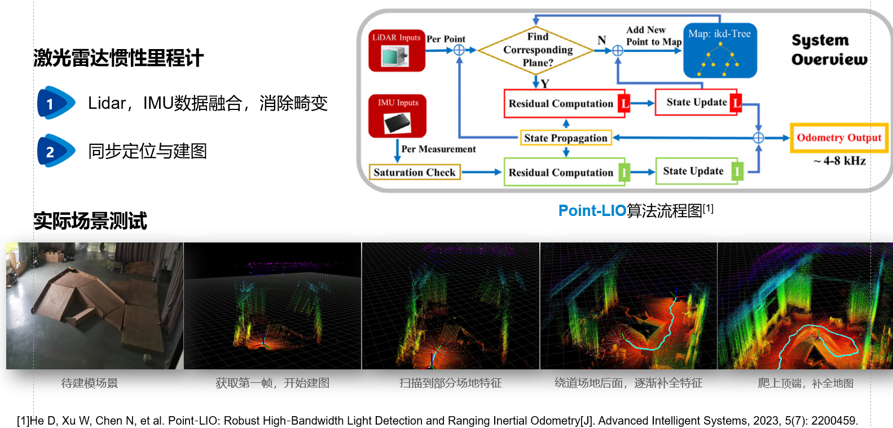

# Fines: Advanced Steerable Wheeled Mobile Robot 🤖

Developed by **IWIN-FINS Lab** (https://iwin-fins.com/), **Fines** is a fully self-developed, advanced steerable wheeled mobile robot equipped with the **Finemote** embedded framework system. Finemote is a modular, real-time embedded framework that simplifies the development of high-mobility robotics applications. It provides a layered architecture, from chip-level peripherals to user-friendly application interfaces, enabling developers to focus on logic implementation while abstracting hardware complexities.

## About Fines Robot 🌟




**Fines** (https://www.bilibili.com/video/BV1JafrYuExw/?spm_id_from=333.1387.upload.video_card.click&vd_source=4d4eae62c343c3c7933578033a53666b)  is a high-precision, high-degree-of-freedom research platform developed by **IWIN-FINS Lab** equipped with **Finemote** framework. Equipped with a robotic arm, industrial camera, point cloud lidar, STM32 microcontroller and upper computer, Fines supports advanced research in SLAM, control learning and so on.

## Features 🚀

- **Hardware Abstraction** 🛠️: Separates board-level and device logic, enabling applications on various development boards (e.g., RoboMaster C, Damo MC-Board01) without modifying application code.
- **Simplified Device Interface** 🖥️: Encapsulates low-level MCU peripherals, providing unified APIs to shield users from complex interrupt handling.
- **Real-Time Control** ⏱️: Supports 1ms periodic interrupts for precise motion control and sensor data processing.
- **Modular Design** 🧩: Manages peripheral-device-component dependencies via `ProjectConfig`, allowing flexible enabling/disabling of components.
- **Modern and Efficient Toolchain** 🔧: Organized with CMake and compiled using Keil’s ArmClang for a balance of modern development and high-efficiency workflows.


## File Structure 📁

```

│ CMakeLists.txt                # Top-level CMake configuration, manages common files and includes BSP submodules
├─Algorithms                    # Algorithms and utility classes for robotics tasks
├─BSP                           # Board Support Packages (BSPs) to abstract hardware differences
│  ├─MC_Board                   # Example BSP package
│  │  │ CMakeLists.txt          # BSP-specific CMake configuration for build targets
│  │  │ MC_Board.cpp            # Implementation of BSP interface
│  │  │ MC_Board.h              # Header file for BSP interface
│  │  │ MC_Board.ioc            # STM32Cube project configuration file
│  │  ├─Core                    # Peripheral configuration files generated by STM32Cube
│  │  ├─Drivers                 # Standard and HAL library files
│  │  └─MDK-ARM                 # Keil MDK project configurations
│  └─Robomaster_C               # Another BSP package with similar structure
├─Components                    # Composite modules representing physically cohesive units
├─Devices                       # General device classes
│  │ DeviceBase.cpp             # Base class defining periodic execution behavior
│  │ DeviceBase.h
│  ├─Controllers                # Controller-related device classes
│  ├─Motors                     # Motor-related device classes
│  └─Sensors                    # Sensor-related device classes
├─Interface                     # User-facing interfaces for application logic
│  │ Interface.cpp              # Provides state machine, Setup/Loop, and timer interrupt callbacks
│  └─ProjectConfig.h            # Manages peripheral-device-component dependencies
├─OpenOCD                       # Configuration files for OpenOCD flashing
├─Services                      # Service classes, primarily for communication buses
└─Tests                         # Test classes for validation

```

## Project Organization 🧠

The Finemote framework adopts a layered architecture, encapsulating functionality from chip-level peripherals to user-friendly application interfaces. This design simplifies development by abstracting hardware complexities. To use Finemote, start with the `Interface` folder:

### Interface Folder

- **InstanceManager** 📋: Manages all instantiated objects in the project. It stores parameters for object construction, handles simple object instantiation, and invokes builders for complex objects.
  - **Instantiation Rule**: Object declarations (using `extern`) are in the `InstanceManager` header, while definitions are in the source file. Since `Interface` includes the `InstanceManager` header, all instantiated objects are accessible in `Interface`.
  - **Construction Order**: Follows a "parts before whole" principle, ensuring dependencies are built before dependent objects.
- **Interface** 🖱️: Provides user-friendly APIs with `Setup` and `Loop` functions, mimicking Python-style programming. Advanced users can leverage 1ms timer interrupt callbacks for precise control.
- **ProjectConfig** ⚙️: Manages dependencies between peripherals, devices, and components. Refer to the documentation for details.





## Getting Started 🚀

### Prerequisites

- **Software**: STM32CubeMX, Keil uVision 5 or CMake 3.20+, OpenOCD
- **Hardware**: STM32-based development board (e.g., RoboMaster C, Damo MC-Board01)

### Build Process

Finemote supports two build systems: **MDK-ARM** and **CMake**, differing only in BSP package selection.

- **MDK-ARM** 🛠️:
  1. Select a BSP package and open its Keil project file to start the project.
- **CMake** 📦:
  1. All BSP packages are included as submodules with predefined build targets.
  2. Choose the desired build target to compile.

### Execution Flow

The program starts from an assembly file (named with a `startup` prefix), which calls `SystemInit` and then `__main` (provided by the standard library). The `__main` function handles pre-execution tasks, including invoking constructors for global variables.

> **Note**: Finemote centralizes initialization in constructors. A `HALInit` singleton class (defined in the BSP package’s header) ensures HAL library initialization occurs before other constructors. This class enables interrupts (e.g., timer interrupts) and is accessed by HAL-dependent classes to guarantee proper initialization.

1. `HALInit` constructor initializes the HAL library and enables interrupts ✅.
2. Global variable constructors are executed.
3. The `main` function runs `Setup`, followed by an infinite `Loop` 🔄.
4. During timer interrupts, device `Handle` functions are executed in reverse registration order.

Build completed! 🚀

## License 📜

This project is licensed under the MIT License. See the LICENSE file for details.

## Declaration

This project is primarily for personal debugging purposes. For the latest official version, please pull from: https://gitee.com/fins-robotics/FineMote.git

## Contact 📧

- **Me**: https://haifengsun.netlify.app/
- **Website**: https://iwin-fins.com/
- **Instruction made by DeepWiki**:https://deepwiki.com/supercuriosity/Finemote-Fines-Robot/1-overview
